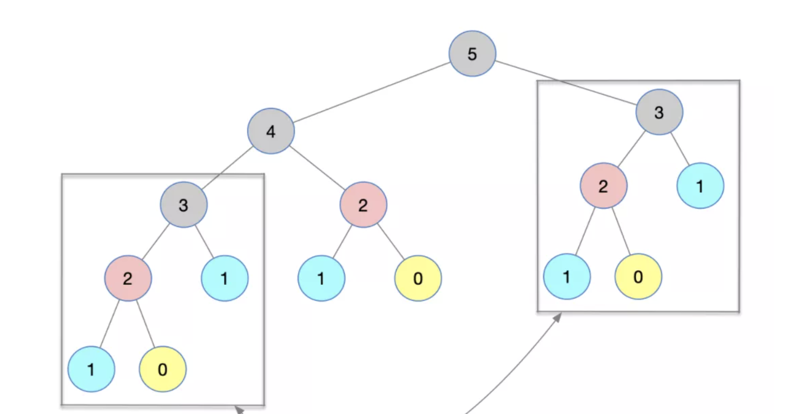

# 动态规划(dp)
动态规划是为了解决重复计算引起的时间复杂度过高的算法思想。

## 斐波切纳数值
斐波切纳数列，是指在一列数字中，当前数字是前两个数字之和。也就是F(N) = F(N - 1) + F(N - 2)。次数可以使用递归来表示。
```
function Fib(n) {
  if (n === 0) return 0
  if (n === 1) return 1
  return Fib(n - 1) + Fib(n - 2)
}
```
计算流程如下



从上图可以看到，3有重复计算的情况。
```
时间度：O(2^N)
空间度：O(N)
```

## 动态规划解决步骤

1. 定义一个一维数组或二维数组，存储，从开始到当前最优化的值，相当于斐波切纳例子中，要存储前两个计算的值。这样在使用到的时候，就不需要再重新计算。
2. 从中找到动态方程式，这个是此算法中最重要的步骤，需要从中提取到公式，即F(N) = F(N - 1) + F(N - 2)
3. 规定临界值，从而启动此算法。即F(0) = 0, F(1) = 1

```
function Fib1(n) {
  const dp = [0, 1]
  for(let i = 2; i <= n - 1; i++) {
    const tmp = dp[0] + dp[1]
    dp[0] = dp[1];
    dp[1] = tmp;
  }
}
```