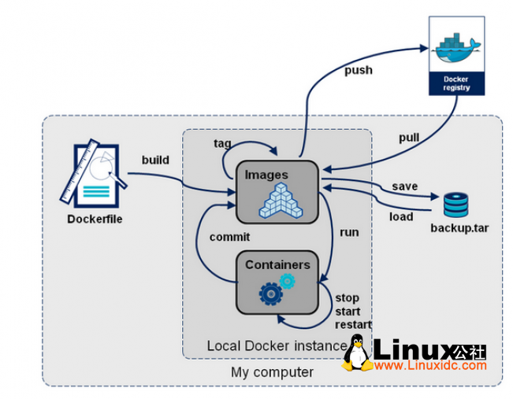

## docker
docker是一个可以允许开发者打包应用以及依赖包到一个可移植的容器中。容器实现虚拟化，沙箱环境运行，相互之间不会有任何接口


## 安装
由于docker镜像放置在sb3上，访问不稳定，可以直接使用DaoCloud提供的docker加速。
可以访问[docker加速下载](http://get.daocloud.io/)

安装以后，可以通过点击工具的registry，设置镜像 http://f1361db2.m.daocloud.io.
具体设置[hub加速](https://www.daocloud.io/mirror#accelerator-doc)

安装后可以运行docker命令，查看是否安装成功

```
mac下查看docker安装目录
ps -u $USER | grep Docker
```

## 说明
### docker 内容
1. image 镜像
2. container容器
3. repository仓库

docker需要先创建镜像，让后使镜像运行在容器中。仓库可以直接用[hub库](https://hub.docker.com/)进行下载

### docker 命令
* docker build . -t test-image:latest

通过 build命令来创建镜像文件

. 表示使用本目录中下的dockerfile文件进行创建
-t 创建带有标记tag版本的镜像，后跟镜像名称,如果需要设置latest标签，可以直接紧跟镜像名称；也可以设置其他tag标签

* docker images

通过此可以查看所有镜像. -a参数可以查看包含中间镜像的所有镜像

* docker run -d -p 80:80 --name test-container test-image:latest

通过docker run来运行镜像，同时创建容器。

-d 容器在后台运行
-p 设置端口映射
--name 设置容器名称，后续直接添加镜像名称和版本号

* docker ps -a 

查看所有容器

