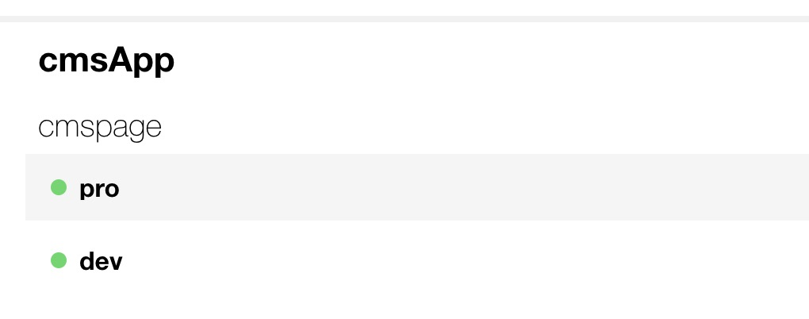

## 腾讯云函数
### 相关概念
>函数及服务

提供了一种在云上运行的无状态、短暂的、由事件驱动指定的能力。由此可见，云函数不是一直运行的，只有在事件发生时，才会触发。
在云函数中，只需要考虑针对一个事件的处理流程，而针对大量事件的高并发处理，由平台实现云函数的多实例并发来支持。

为了适应平台提供的自动的弹性伸缩能力，及在大量请求时，通过启动更多的实例来处理事件请求。因此，云函数中不能存储相关的状态数据，以及依赖此状态数据的计算。状态数据可以通过外出持久化存储进行支持，例如云存储，云数据库等

>触发器

任何可以产生事件，触发云函数执行的均可以成为触发器，触发器触发事件时，会将事件传递给云函数。

触发器在触发函数时，可以分为同步和异步方式。

同步时，触发器会等待云函数返回执行结果

异步时，触发器仅触发执行，不会等待返回执行结果

事件传递时，将会按照json格式，以event参数传入到函数中

### 工作原理
#### 运行时的容器模型
运行时执行的云函数，会根据配置信息(入内存大小)进行资源分配，并动态创建容器、管理和删除清理操作，用户没有权限进行管理。
所以在执行云函数时，会有一定的启动延迟时间。

平台为了减少延迟时间，会尝试对后续调用重用容器，是否重用有平台决定。因此在代码中，有时需要判断，是否有重用的链接，如果有的话，不需要重新创建或获取。

每次执行过程，会有512M的临时磁盘空间，可以进行一些读写操作。如果需要进行持久化，可以使用外部存储。

可以通过调用SCF函数时，通过invokeFunction中的invokeType=RequestResponse（同步）和invokeType=Event（异步）.

腾讯云服务为事件源的时候，
1. 同步调用： API网关触发、CKafka触发器。运行完成后，返回json格式的数据
2. 异步调用: COS触发器、定时器触发、CMQ Topic触发器。运行结果会已json格式存储在日志中，可以同requestid查询日志获取

### 函数创建
#### 执行方法
此说明运行云函数时，需要从哪个函数执行，及入口函数
1. Golang环境：【文件名】，如：main
2. NodeJS、python、PHP环境：【文件名】.【函数名】，如：index.main_handler
3. JAVA环境: 【package】.【class】:【method】,如：example.Hello:mainHandler

函数创建时，需要提供(必填)，FunctionName、运行环境Runtime、函数代码路径Code、执行方法handler;

(选填)，内存大小MemorySize、运行超时Timeout、环境变量Environment、私有网络VPCConfig

#### 别名管理
可以通过腾讯云控制台，设置路由别名。从而指定到不同的发布版本。

设置路由方法：
1. 按权重路由，通过设置不同百分比，将流量导入到不同版本
2. 规则路由，

  * 匹配key，支持invoke.headers.[userKey],其中userKey为可修改内容
  * 匹配方法，分为 exact精确匹配，range区间匹配

#### 层管理
层是为了解决，降低云函数代码块大小的问题，降低启动云函数的延迟时间。层中主要存储代码中公用依赖库，比如nodejs中的node_module，此时，在运行函数中只需要require即可。

层中的文件会加载到/opt下，此目录在函数执行期间可以访问

### 触发器
云函数时典型的事件触发形态的无服务器运行环境，核心组件是SCF函数和事件源。

1. API网关触发器

发送的event如下
```
{
  "requestContext": {
    "serviceId": "service-f94sy04v",
    "path": "/test/{path}",
    "httpMethod": "POST",
    "requestId": "c6af9ac6-7b61-11e6-9a41-93e8deadbeef",
    "identity": {
      "secretId": "abdcdxxxxxxxsdfs"
    },
    "sourceIp": "10.0.2.14",
    "stage": "release"
  },
  "headers": {
    "Accept-Language": "en-US,en,cn",
    "Accept": "text/html,application/xml,application/json",
    "Host": "service-3ei3tii4-251000691.ap-guangzhou.apigateway.myqloud.com",
    "User-Agent": "User Agent String"
  },
  "body": "{\"test\":\"body\"}",
  "pathParameters": {
    "path": "value"
  },
  "queryStringParameters": {
    "foo": "bar"
  },
  "headerParameters":{
    "Refer": "10.0.2.14"
  },
  "stageVariables": {
    "stage": "release"
  },
  "path": "/test/value",
  "queryString": {
    "foo" : "bar",
    "bob" : "alice"
  },
  "httpMethod": "POST"
}
```
2. 定时触发器

```
{
    "Type":"Timer",
    "TriggerName":"EveryDay",
    "Time":"2019-02-21T11:49:00Z",
    "Message":"user define msg body"
}
```
3. COS触发器

```
{
    "Records": [{
        "cos": {
            "cosSchemaVersion": "1.0",
            "cosObject": {
                "url": "http://testpic-1253970026.cos.ap-chengdu.myqcloud.com/testfile",
                "meta": {
                    "x-cos-request-id": "NWMxOWY4MGFfMjViMjU4NjRfMTUyMV8yNzhhZjM=",
                    "Content-Type": ""
                },
                "vid": "",
                "key": "/1253970026/testpic/testfile",
                "size": 1029
            },
            "cosBucket": {
                "region": "cd",
                "name": "testpic",
                "appid": "1253970026"
            },
            "cosNotificationId": "unkown"
        },
        "event": {
            "eventName": "cos:ObjectCreated:*",
            "eventVersion": "1.0",
            "eventTime": 1545205770,
            "eventSource": "qcs::cos",
            "requestParameters": {
                "requestSourceIP": "192.168.15.101",
                "requestHeaders": {
                    "Authorization": "q-sign-algorithm=sha1&q-ak=AKIDQm6iUh2NJ6jL41tVUis9KpY5Rgv49zyC&q-sign-time=1545205709;1545215769&q-key-time=1545205709;1545215769&q-header-list=host;x-cos-storage-class&q-url-param-list=&q-signature=098ac7dfe9cf21116f946c4b4c29001c2b449b14"
                }
            },
            "eventQueue": "qcs:0:lambda:cd:appid/1253970026:default.printevent.$LATEST",
            "reservedInfo": "",
            "reqid": 179398952
        }
    }]
}
```
4. CKAfka触发器

```
{
  "Records": [
    {
      "Ckafka": {
        "topic": "test-topic",
        "partition":1,
        "offset":36,
        "msgKey": "None",
        "msgBody": "Hello from Ckafka!"
      }
    },
    {
      "Ckafka": {
        "topic": "test-topic",
        "partition":1,
        "offset":37,
        "msgKey": "None",
        "msgBody": "Hello from Ckafka again!"
      }
    }
  ]
}
```
5. CMQ Topic触发器
```
{
  "Records": [
    {
      "CMQ": {
        "type": "topic",
        "topicOwner":"120xxxxx",
        "topicName": "testtopic",
        "subscriptionName":"xxxxxx",
        "publishTime": "1970-01-01T00:00:00.000Z",
        "msgId": "123345346",
        "requestId":"123345346",
        "msgBody": "Hello from CMQ!",
        "msgTag": "tag1,tag2"
      }
    }
  ]
}
```
6. 云API触发器
7. 自定义程序触发器

### 创建静态网站(VUE)
对于serverless来说，只需要serverless.yml配置和指定代码目录即可。
1. 通过vue-cli初始化vue项目
2. 配置serverless.yml，如下
```
component: website #必填，为tecent提供的component类型
name: cmspage #必填 实例名称
org: cxp #非必填 
app: cmsApp #非必填
stage: dev # 环境

inputs:
  src:
    src: ./src
    hook: npm run build
    dist: ./dist
    index: index.html
    error: index.html
  region: ap-guangzhou
  protocol: http
```
>详细配置信息，请[查看](https://github.com/serverless-components/tencent-website/blob/master/docs/configure.md#CDN-%E9%85%8D%E7%BD%AE)

3. 设置不同的构建环境

通过设置配置中的stage可以区分开发环境和部署环境代码，最终生成的名称为${name}-${stage}-${app}。

也可以通过sls deploy --stage 来指定环境，比如：

sls deploy --stage dev,为dev开发环境

sls deploy --stage pro,为pro生产环境

打开控制台，选择serverless产品后，会看到2个环境的包



