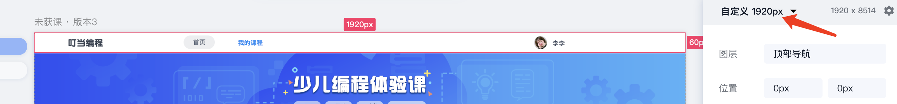
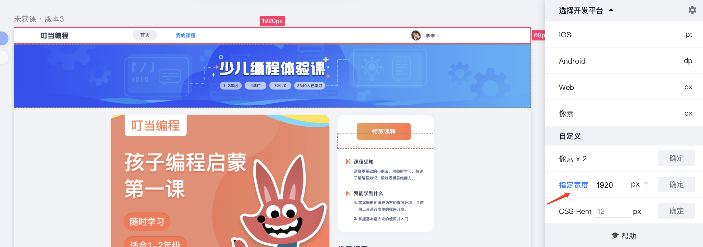

## 环境搭建
vue技术栈：vue2、vue-router、vuex、eslint、webpack、babel、jest、DevTools
## 文档地址
1. [vue](https://cn.vuejs.org/v2/guide/)
2. [vue-router](https://router.vuejs.org/zh/installation.html)
3. [vuex](https://vuex.vuejs.org/zh/)
4. [eslint](https://atom.io/packages/eslint)
5. [webpack](https://www.webpackjs.com/concepts/)
6. [babel](https://www.babeljs.cn/)
7. [Vue CLI](https://cli.vuejs.org/zh/guide/)
8. [DevTools](https://github.com/vuejs/vue-devtools)
9. [jest](https://jestjs.io/docs/zh-Hans/cli)
10. [vue-vscode-snippets插件](https://github.com/sdras/vue-vscode-snippets)
### 脚手架搭建
使用@vue/cli包来进行vue项目搭建。
```
npm install -g @vue/cli
# OR
yarn global add @vue/cli
```
更新
```
npm update -g @vue/cli

# 或者
yarn global upgrade --latest @vue/cli
```
#### 创建项目
```
vue create project
```
### 文件目录说明
public: 存储一些静态文件，在此文件夹下的文件，在url访问的时候，直接origin+文件名

src: 具体的实现代码

>assets: 网页中的静态资源；图片、css、字体、音视频资源

>components: 公用的全局组件

>directive: 公用的全局指令

>pages: 具体页面

>router: 路由配置

>services: 请求后台接口文件

>stores: vuex配置信息

>utils: 公用工具信息

>test: 单元测试文件夹

>App.vue: 页面根，在此页面中配置布局、公用处理逻辑

>main.js: 程序入口，在此实例化vue组件，注册全局方法信息

>.env.xxx: 程序配置信息，一些环境变量在此引入，使用VUE_APP_开头声明

>babel.config.js babel配置信息

>vue.config.js 在此对打包部署等信息配置

### 编写页面步骤

1. 在page中创建页面，初始化页面结构
   ```
   <template>
      <div>

      </div>
   </template>

   <script>
   export default {
      
   }
   </script>

   <style lang="less" scoped>

   </style>
   ```
2. 根据蓝湖上ui，进行页面布局，现在h5的页面宽度为750px，pc端宽度为1920px，所以在蓝湖上需要首先对设计稿的宽度进行修改，如图：
   
   
我们现在页面中元素宽高，为了自适应都是用rem单位，相对px来说，只需要根据蓝湖上标识的 *px数值/100* 即可得到rem的值

3. 请求后台接口步骤
   
   1. 在stores/mutation-types.js中声明静态唯一值

      ```
         export const GET_LESSON_CLASS_TEST_LESSONS = 'GET_LESSON_CLASS_TEST_LESSONS'
      ```
   2. 在services/文件夹下创建文件后，在文件中书写请求后台接口的方法

      ```
         import rq from './common'
         export async function getCourseLessonListPc (opt) {
            const ret = await rq.get({path: `/web/course-lesson/mylist?courseId=${opt.courseId}&userId=${opt.userId}&t=${new Date().getTime()}`})
            return ret.data
         }
      ```
   3. 在stores/创建文件，然后在文件中声明以下结构, 并触发调用service中声明的方法

      ```
      import {GET_LESSON_CLASS_TEST_LESSONS} from '../mutation-types'
      import {getCourseLessonListPc} from '@/services/lesson'
      export default {
         namespaced: true,
         // vuex中的state，存放全局的数据，所有页面可以访问
         state: {
            value: 'myvalue',
            lessonClassList: []
         },
         // 帮助方法，页面中可以直接调用getters，获取相应的值，不需要嵌套链式调用，方便书写
         getters: {
            getterValue: state => {
               return state.value
            }
         },
         // 将state中存放值
         mutations: {
            updateValue: (state, payload) => {
               state.value = payload
            },
            [GET_LESSON_CLASS_TEST_LESSONS] (state, payload) {
                  state.lessonClassList = payload
            }
         },
         // 调用action，最终调用后台接口
         actions: {
            updateActionValue({ commit }) {
               // 触发commit，执行mutations中的方法，最终将返回的值存放到state中
               commit('updateValue', payload)
            },
            async [GET_LESSON_CLASS_TEST_LESSONS] ({commit}, payload) {
                  const ret = await getCourseLessonListPc(payload)
                  if (ret.code === 1) {
                     // 此处可以commit，将后台返回的值放入到vuex的state中，也可以不commit，直接return 后台返回的数据到页面上
                     commit(Types.GET_LESSON_CLASS_TEST_LESSONS, ret.data)
                     return ret.data
                  } else return null
            }
         }
      }
      ```
   4. 页面上触发请求
      ```
      // 在script中
      import { GET_LESSON_CLASS_TEST_LESSONS} from '@/stores/mutation-types'
      import { mapState, mapActions } from 'vuex'
      // 如果在上一步中将数据存储到了vuex中的state中，则
      computed: {
         ...mapState('lesson', {
         lessonClassList: 'lessonClassList'
         })
      }
      // 在methods方法中，书写调用
      methods: {
         ...mapActions('lesson', {
            GET_LESSON_CLASS_TEST_LESSONS: `${GET_LESSON_CLASS_TEST_LESSONS}`
         }),

      }
      // 在页面点击事件或加载完成后的事件中调用
      mounted () {
         this.GET_LESSON_CLASS_TEST_LESSONS({params})
      }
      ```

