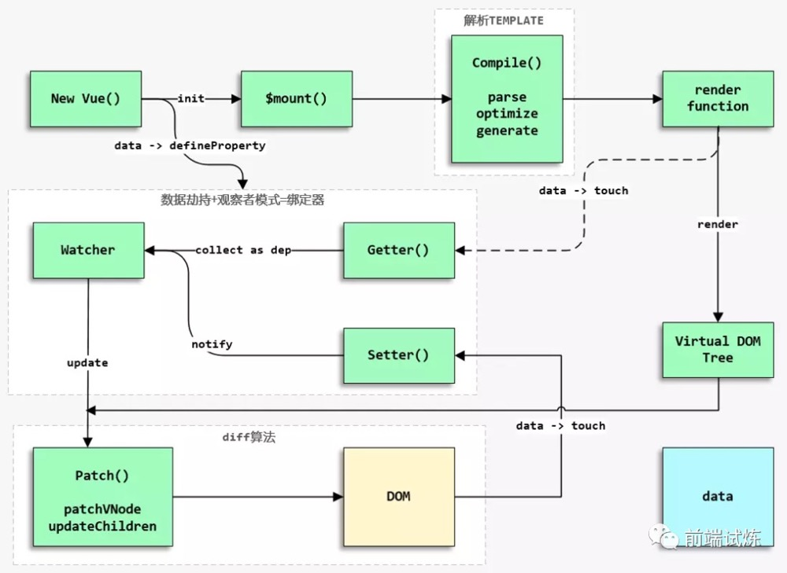
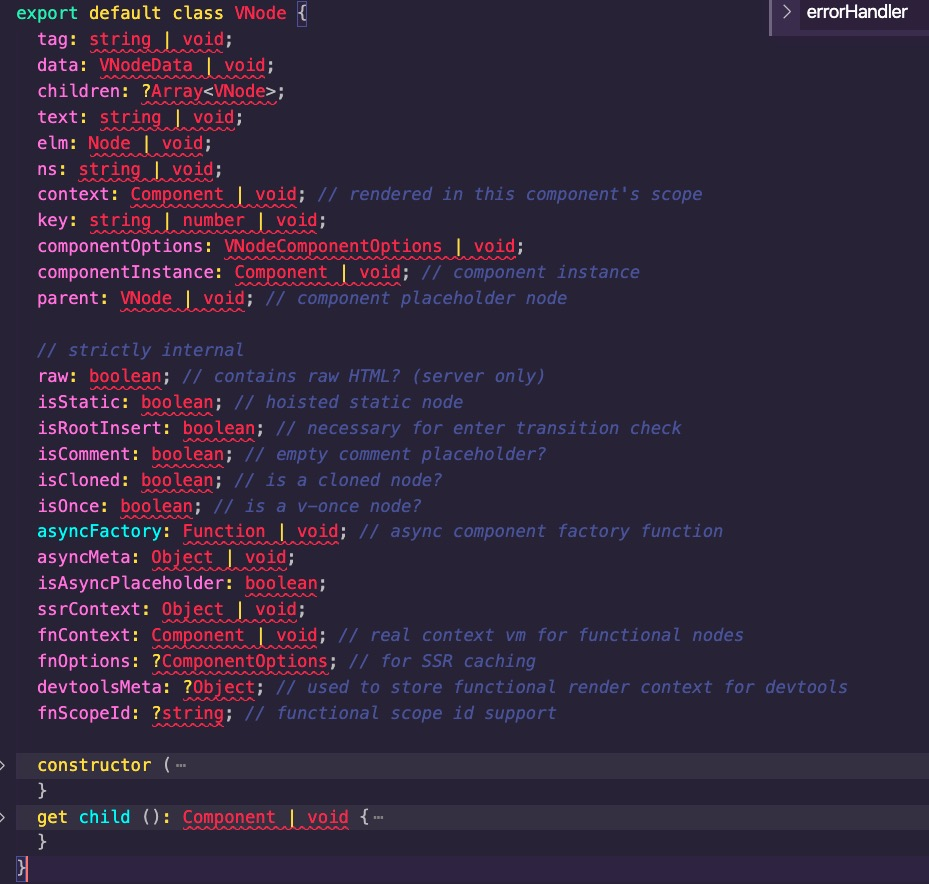
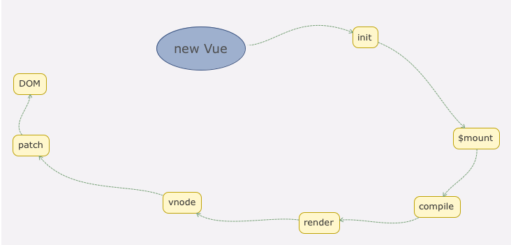

# 源码解析
## src文件目录
- src
  - compiler 编译相关, 解析成ast语法树
  - core 核心代码
  - platforms 平台相关，有web和weex2个入口
  - server 服务端渲染
  - sfc 解析.vue文件到JavaScript对象
  - shared 共享代码，浏览器端和服务器端vue使用

## 构建
vue是通过rollup构建
开发环境调用script/config.js中配置rollup信息。通过指定TARGET参数来获取不同的rollup配置信息

线上环境通过调用scripts/build.js，直接node运行。

其中通过script/alias.js指定别名具体的入口目录。

不管是开发环境，还是线上环境，rollup的配置信息都在script/config中，其中每一种都分runtime-only和Runtime+compiler两种编译模式。

runtime-only为前置编译，最终只有运行时代码。

### Vue 构建流程图


## web版本的Runtime+compiler
入口文件为/src/platforms/web/entry-runtime-with-compiler.js

### new Vue发生什么
- 在import Vue from 'vue'时，主要为声明Vue对象的一些属性和全局属性，包括Config、data、生命周期等。
  代码都在src/core/instance中。
- 在 new Vue时，由于Vue为Function，需要new使用。通过
  ```
  function Vue (options) {
    if (process.env.NODE_ENV !== 'production' &&
      !(this instanceof Vue)
    ) {
      warn('Vue is a constructor and should be called with the `new` keyword')
    }
    this._init(options)
  }
  其中_init方法在import时，已经添加到Vue.prototype中。
  ```
  在_init中，主要是合并配置，初始化生命周期，初始化事件中心，初始化渲染，初始化data、props、computed等。
  在_init最后，如果vm.$options.el有的话，直接挂在vm到el中。
  由于vue是跨平台的，所以$mount在不同的平台有不同的挂在实现
  ```
  // 将$mount缓存起来
  const mount = Vue.prototype.$mount
  // 重新声明$mount方法
  Vue.prototype.$mount = function (
    el?: string | Element,
    hydrating?: boolean
  ): Component {
    // 查找el节点
    el = el && query(el) 

    // 限制不能把vue挂在到html和body上
    /* istanbul ignore if */
    if (el === document.body || el === document.documentElement) {
      process.env.NODE_ENV !== 'production' && warn(
        `Do not mount Vue to <html> or <body> - mount to normal elements instead.`
      )
      return this
    }

    const options = this.$options
    // resolve template/el and convert to render function
    // 如果没有声明render方法，则将template或el直接转换为render方法
    if (!options.render) {
      let template = options.template
      if (template) {
        if (typeof template === 'string') {
          if (template.charAt(0) === '#') {
            // 如果template是字符串，并且是#开头的，直接通过查找id获取其innnerHtml
            template = idToTemplate(template)
            /* istanbul ignore if */
            if (process.env.NODE_ENV !== 'production' && !template) {
              warn(
                `Template element not found or is empty: ${options.template}`,
                this
              )
            }
          }
        } else if (template.nodeType) {
          // 如果是dom元素，则直接取innerHtml
          template = template.innerHTML
        } else {
          if (process.env.NODE_ENV !== 'production') {
            warn('invalid template option:' + template, this)
          }
          return this
        }
      } else if (el) {
        // 获取el的OuterHTML字符串
        template = getOuterHTML(el)
      }
      if (template) {
        /* istanbul ignore if */
        // 设置performance标记
        if (process.env.NODE_ENV !== 'production' && config.performance && mark) {
          mark('compile')
        }
        // 通过compile编译，返回render方法，
        const { render, staticRenderFns } = compileToFunctions(template, {
          outputSourceRange: process.env.NODE_ENV !== 'production',
          shouldDecodeNewlines,
          shouldDecodeNewlinesForHref,
          delimiters: options.delimiters,
          comments: options.comments
        }, this)
        options.render = render
        options.staticRenderFns = staticRenderFns

        /* istanbul ignore if */
        if (process.env.NODE_ENV !== 'production' && config.performance && mark) {
          mark('compile end')
          measure(`vue ${this._name} compile`, 'compile', 'compile end')
        }
      }
    }
    // 调用之前缓存的mount方法。
    // 其$mount方法在src/platforms/web/runtime/index中声明
    return mount.call(this, el, hydrating)
  }
  ```
  #### src/platforms/web/runtime/index$mount
  ```
  // public mount method
  Vue.prototype.$mount = function (
    el?: string | Element,
    hydrating?: boolean
  ): Component {
    el = el && inBrowser ? query(el) : undefined
    return mountComponent(this, el, hydrating)
  }

  // instance/lifecycle.js

  export function mountComponent (
    vm: Component,
    el: ?Element,
    hydrating?: boolean
  ): Component {
    vm.$el = el
    if (!vm.$options.render) {
      // 通过createEmptyVNode创建vnode
      vm.$options.render = createEmptyVNode
      if (process.env.NODE_ENV !== 'production') {
        /* istanbul ignore if */
        if ((vm.$options.template && vm.$options.template.charAt(0) !== '#') ||
          vm.$options.el || el) {
          warn(
            'You are using the runtime-only build of Vue where the template ' +
            'compiler is not available. Either pre-compile the templates into ' +
            'render functions, or use the compiler-included build.',
            vm
          )
        } else {
          warn(
            'Failed to mount component: template or render function not defined.',
            vm
          )
        }
      }
    }
    // callHook方法，通过查看option里是否有钩子函数，如果有的话，则调用钩子函数
    callHook(vm, 'beforeMount')

    // 声明方法，在此方法中调用_update和_render方法
    let updateComponent
    /* istanbul ignore if */
    if (process.env.NODE_ENV !== 'production' && config.performance && mark) {
      updateComponent = () => {
        const name = vm._name
        const id = vm._uid
        const startTag = `vue-perf-start:${id}`
        const endTag = `vue-perf-end:${id}`

        mark(startTag)
        const vnode = vm._render()
        mark(endTag)
        measure(`vue ${name} render`, startTag, endTag)

        mark(startTag)
        vm._update(vnode, hydrating)
        mark(endTag)
        measure(`vue ${name} patch`, startTag, endTag)
      }
    } else {
      updateComponent = () => {
        vm._update(vm._render(), hydrating)
      }
    }

    // we set this to vm._watcher inside the watcher's constructor
    // since the watcher's initial patch may call $forceUpdate (e.g. inside child
    // component's mounted hook), which relies on vm._watcher being already defined
    // 创建Watcher，放入到vm._watchers中，监控数据改变后，直接调用updateComponent
    new Watcher(vm, updateComponent, noop, {
      before () {
        if (vm._isMounted && !vm._isDestroyed) {
          callHook(vm, 'beforeUpdate')
        }
      }
    }, true /* isRenderWatcher */)
    hydrating = false

    // manually mounted instance, call mounted on self
    // mounted is called for render-created child components in its inserted hook
    // 如果为根节点，则调用mounted方法
    if (vm.$vnode == null) {
      vm._isMounted = true
      callHook(vm, 'mounted')
    }
    return vm
  }
  ```
### _render
在src/core/instance/render.js中
```
// 返回VNode方法
Vue.prototype._render = function (): VNode {
  const vm: Component = this
  // 此处render，如果options里没有的话，会直接在$mount里创建后，放入到option中
  const { render, _parentVnode } = vm.$options

  if (_parentVnode) {
    vm.$scopedSlots = normalizeScopedSlots(
      _parentVnode.data.scopedSlots,
      vm.$slots,
      vm.$scopedSlots
    )
  }

  // set parent vnode. this allows render functions to have access
  // to the data on the placeholder node.
  vm.$vnode = _parentVnode
  // render self
  let vnode
  try {
    // There's no need to maintain a stack because all render fns are called
    // separately from one another. Nested component's render fns are called
    // when parent component is patched.
    currentRenderingInstance = vm
    // 调用render方法，其中参数vm.$createElement为用户手写render
    vnode = render.call(vm._renderProxy, vm.$createElement)
  } catch (e) {
    handleError(e, vm, `render`)
    // return error render result,
    // or previous vnode to prevent render error causing blank component
    /* istanbul ignore else */
    if (process.env.NODE_ENV !== 'production' && vm.$options.renderError) {
      try {
        vnode = vm.$options.renderError.call(vm._renderProxy, vm.$createElement, e)
      } catch (e) {
        handleError(e, vm, `renderError`)
        vnode = vm._vnode
      }
    } else {
      vnode = vm._vnode
    }
  } finally {
    currentRenderingInstance = null
  }
  // if the returned array contains only a single node, allow it
  // 生成的vnode只能是一个节点
  if (Array.isArray(vnode) && vnode.length === 1) {
    vnode = vnode[0]
  }
  // return empty vnode in case the render function errored out
  if (!(vnode instanceof VNode)) {
    if (process.env.NODE_ENV !== 'production' && Array.isArray(vnode)) {
      warn(
        'Multiple root nodes returned from render function. Render function ' +
        'should return a single root node.',
        vm
      )
    }
    vnode = createEmptyVNode()
  }
  // set parent
  vnode.parent = _parentVnode
  return vnode
}
```
### virtualDom
通过render返回的VNode为虚拟dom，即virtualDom

代码位于src/core/vdom/vnode.js，为声明的一个简单的类.
从virtualDom到真实dom，需要经过create、diff、patch等过程


#### createElement
vue通过createElement创建VNode,代码在src/core/vdom/create-element.js中
```
// 通过对参数进行处理，最后调用_createElement方法
export function createElement (
  context: Component,
  tag: any,
  data: any,
  children: any,
  normalizationType: any,
  alwaysNormalize: boolean
): VNode | Array<VNode> {
  // data是数组或是原始类型数据
  if (Array.isArray(data) || isPrimitive(data)) {
    normalizationType = children
    children = data
    data = undefined
  }
  if (isTrue(alwaysNormalize)) {
    normalizationType = ALWAYS_NORMALIZE
  }
  return _createElement(context, tag, data, children, normalizationType)
}

export function _createElement (
  context: Component,
  tag?: string | Class<Component> | Function | Object,
  data?: VNodeData,
  children?: any,
  normalizationType?: number
): VNode | Array<VNode> {
  // data不为undefined或null，并且data已经处于监控模式
  if (isDef(data) && isDef((data: any).__ob__)) {
    process.env.NODE_ENV !== 'production' && warn(
      `Avoid using observed data object as vnode data: ${JSON.stringify(data)}\n` +
      'Always create fresh vnode data objects in each render!',
      context
    )
    // 返回空vnode
    return createEmptyVNode()
  }
  // object syntax in v-bind
  if (isDef(data) && isDef(data.is)) {
    tag = data.is
  }
  if (!tag) {
    // in case of component :is set to falsy value
    return createEmptyVNode()
  }
  // warn against non-primitive key
  if (process.env.NODE_ENV !== 'production' &&
    isDef(data) && isDef(data.key) && !isPrimitive(data.key)
  ) {
    if (!__WEEX__ || !('@binding' in data.key)) {
      warn(
        'Avoid using non-primitive value as key, ' +
        'use string/number value instead.',
        context
      )
    }
  }
  // support single function children as default scoped slot
  if (Array.isArray(children) &&
    typeof children[0] === 'function'
  ) {
    data = data || {}
    data.scopedSlots = { default: children[0] }
    children.length = 0
  }
  // 根据children不同的类型，格式化children，返回vnode类型
  if (normalizationType === ALWAYS_NORMALIZE) {
    children = normalizeChildren(children)
  } else if (normalizationType === SIMPLE_NORMALIZE) {
    children = simpleNormalizeChildren(children)
  }
  let vnode, ns
  if (typeof tag === 'string') {
    let Ctor
    ns = (context.$vnode && context.$vnode.ns) || config.getTagNamespace(tag)
    if (config.isReservedTag(tag)) {
      // platform built-in elements
      if (process.env.NODE_ENV !== 'production' && isDef(data) && isDef(data.nativeOn)) {
        warn(
          `The .native modifier for v-on is only valid on components but it was used on <${tag}>.`,
          context
        )
      }
      vnode = new VNode(
        config.parsePlatformTagName(tag), data, children,
        undefined, undefined, context
      )
    } else if ((!data || !data.pre) && isDef(Ctor = resolveAsset(context.$options, 'components', tag))) {
      // component
      vnode = createComponent(Ctor, data, context, children, tag)
    } else {
      // unknown or unlisted namespaced elements
      // check at runtime because it may get assigned a namespace when its
      // parent normalizes children
      vnode = new VNode(
        tag, data, children,
        undefined, undefined, context
      )
    }
  } else {
    // direct component options / constructor
    vnode = createComponent(tag, data, context, children)
  }
  if (Array.isArray(vnode)) {
    return vnode
  } else if (isDef(vnode)) {
    if (isDef(ns)) applyNS(vnode, ns)
    if (isDef(data)) registerDeepBindings(data)
    return vnode
  } else {
    return createEmptyVNode()
  }
}
```
#### _update
代码在/src/core/instance/lifecycle.js中，通过在初始化时候声明.此方式在首次渲染和数据变更后，触发。

在_update方法中最主要是调用vm.__patch__方法。此方法在weex和web平台有不同的实现。

web中代码在/src/platforms/web/runtime/index.js中
```
// install platform patch function
// 根据是否在浏览器中，调用不同的patch。
// noop为一个空方法
// patch代码为/src/platforms/web/runtime/patch.js
Vue.prototype.__patch__ = inBrowser ? patch : noop
```

```
// 声明了一些dom操作的方法
import * as nodeOps from 'web/runtime/node-ops'
import { createPatchFunction } from 'core/vdom/patch'
// 包括directive和ref
import baseModules from 'core/vdom/modules/index'
import platformModules from 'web/runtime/modules/index'

// the directive module should be applied last, after all
// built-in modules have been applied.
const modules = platformModules.concat(baseModules)
export const patch: Function = createPatchFunction({ nodeOps, modules })
```
#### vue从初始化到生成dom过程


## Object.defineProperty(obj, prop, descriptor)
### descriptor
1. configurable
2. enumerable
3. value
4. writable
5. get
6. set
会创建新的对象属性，或修改已存在的属性，并返回此对象
```
const obj = {};
Object.defineProperty(obj, 'prop', {
    value: 42,
    writable: true
});
console.log(obj); // {prop: 42}
obj.prop = 43; // {prop: 43}
```
* Object.defineProperty可以修改和创建属性
* Object.defineProperty声明的属性是不可变的，不能通过delete删除，但let obj = {}; obj.pro = 2是可变的，能够删除，并能通过for...in和Object.keys获取到
* 互斥属性value,writable（data descriptor）和get，set(accessor descriptor)不能同时设置
* 可以同时设置的属性为：configurable和enumerable
* configurable为true时，此属性才能改变，同时也能删除
* enumerable为true是，才能进行枚举